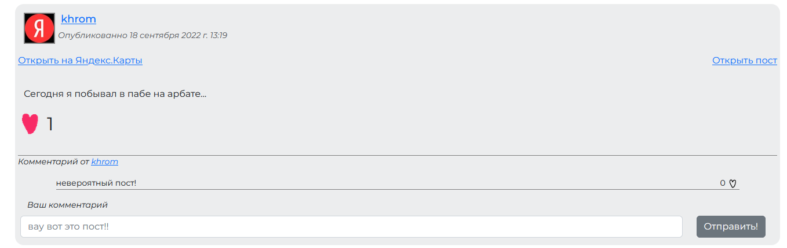
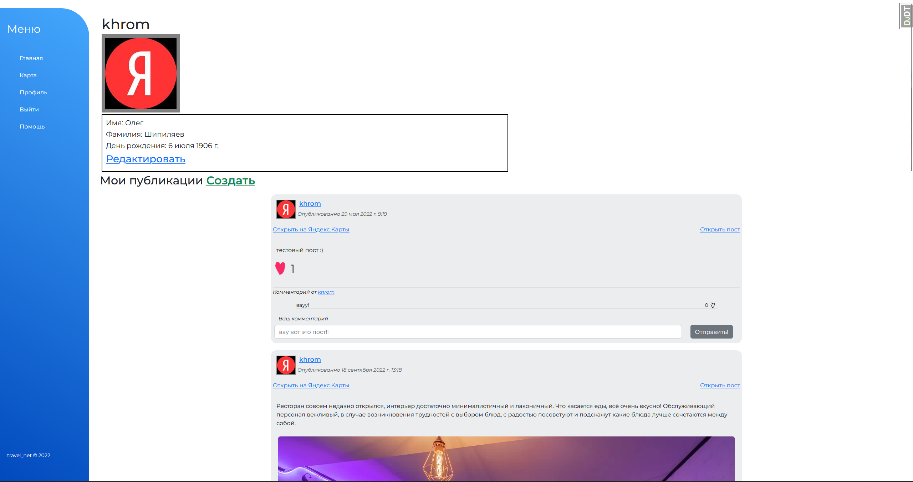

# TravelNet
Социальная сеть для любителей путешествий и нестандартного отдыха\
Сделано для Яндекс.Лицей++, трек backend разрабтки

## Функционал
- Посты, лайки, комменты, лайки на комментах
- Бесконечный скорлл ленты 
- Личный профиль - аватарка + имя фамилия 
- В каждом посте есть вложенная геолокация + вложения картинок (опционально)
- Карта с отображением самых популярных постов на местности

## Как запустить? 
1. `$ git clone https://github.com/izlatin/travel_net`
2. Создать файл `.env` и положить в папку travelnet/, можно использовать `example.env` за основу
3. `$ cd travelnet && python manage.py runserver`
4. Заходим на http://localhost:8000
5. profit 😎

## Скриншоты

### переменные .env 
- `MAPBOX_TOKEN` - Токен для mapbox, без него на фронте не будет грузиться карта (как и запускаться проект)
- `DEBUG` - Режим отладки, true/false
- `SECRET_KEY` - Ваш секретный ключ для криптографии в Django

